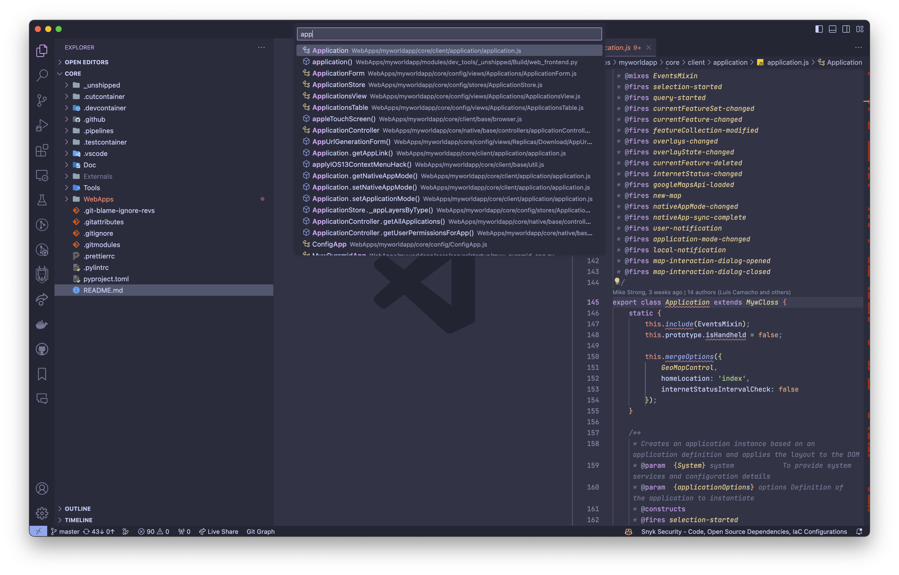

<div style="display: flex; align-items: center; column-gap: 15px;">
    
    <h1 style="border-bottom: 0; margin-top: 0.3em; margin-bottom: 0">IQGeo VS Code Utils</h1>
</div>

<br>
IQGeo development extension to support code navigation and additional linting in Visual Studio Code.

The extension provides the following features:

1. An alternative definition search dialog that shows a preview of the highlighted result in an editor.<br>
   The search supports JavaScript and Python and accepts these query formats:
    - \<method name\>
    - \<class name\>
    - \<class name\>.\<method name\>
    - \<file name or path\>



2. Enhanced navigation to the definitions using the standard commands in VS Code. (e.g. Go to Definition, Peek Definition, Go to Symbol, ...).<br>

3. Linting for API usage and subclassing.

4. Set of shortcuts for

    - Definition search
    - Code navigation
    - Text search
    - Workspace layouts

5. Command to create JSDoc comment for a function or class.<br>
   Press Ctrl+Shift+D when the cursor is on the definition line to create a JSDoc comment populated with the parameters. Any defaults will be included.

6. Command to update an IQGeo project based on options in `.iqgeorc.jsonc` configuration file.<br>
   "IQGeo Update Project from .iqgeorc.jsonc" is available from the command palette (Ctrl+Cmd+P or Ctrl+Shift+P) or from the right click menu when editing `.iqgeorc.jsonc`.<br>
   See [`utils-project-template`](https://github.com/IQGeo/utils-project-template) and [`utils-project-update`](https://github.com/IQGeo/utils-project-update#default-update) for details.

7. Command to pull and merge latest changes from [`utils-project-template`](https://github.com/IQGeo/utils-project-template) with existing project files.<br>
   "IQGeo Pull and merge files from project-template" is available from the command palette (Ctrl+Cmd+P or Ctrl+Shift+P) or from the right click menu when editing `.iqgeorc.jsonc`.<br>
   See [`utils-project-template`](https://github.com/IQGeo/utils-project-template) and [`utils-project-update`](https://github.com/IQGeo/utils-project-update#pull) for details.

8. File watch to restart Python or browser debug session when a Python or JavaScript file change respectively.<br>
   This functionality is enabled when **iqgeo-utils-vscode.enableAutoRestart** is set to true.<br>
   The extension uses one terminal to restart the Python environment and another to run a Javascript file watch. A browser debug session (if active) will be restarted when a JavaScript file is saved.<br>
   The watch can be started using the command 'IQGeo Start Watch'.<br>
   The delay between saving a JavaScript file and restarting a debug session (to allow the watch build to complete) can be configured using the setting **iqgeo-utils-vscode.restartDelay** (defaults to 1500ms).

<br>
The extension scans for definitions in the paths specified by the setting iqgeo-utils-vscode.searchPaths (see below).<br>
The search path defaults to the workspace folder or /opt/iqgeo/platform/WebApps/myworldapp when inside a dev container.<br>
Files are automatically rescanned when saved.

## Usage

### Definition Search

-   Search Definitions = **CMD + T** (**Ctrl + T**).<br>
    The search supports \<method name\> or \<class name\> or \<class\>.\<method\><br>
    Use \<class name\>. to list all functions for a class.<br>
    Use @\<partial path\> to list classes matching the path.<br>

    The search is case-insensitive. Matching inherited methods are shown in results.<br>

    Use the up and down arrows in the search result list to update the preview.

-   Scan Files (IQGeo Refresh Symbols) = **Ctrl + T** (**Alt + T**)<br>
    (e.g. after changing branch)

### Text Search

-   Search in the root folder = **CMD + G** (**Ctrl + G**)

-   Search in the workspace (repository) folder = **CMD + R** (**Ctrl + R**)

-   Search core folder in Platform = **Shift + CMD + R** (**Shift + Ctrl + R**)

-   Open Editor Search with current selection or word = **Ctrl + G** (**Alt + G**)

### Navigation

-   Go to Definition = **CMD + .** (**Alt + .**)

-   Go Back = **Ctrl + CMD + Left** (**Alt + Left**)

-   Definition search with current selection or word = **CMD + ;** (**Ctrl + ;**)

-   Peek Definition = **Ctrl + .**

-   Go to References = **CMD + ,** (**Alt + ,**)

<br>

-   Definition Up = **CMD + PageUp** (**Ctrl + PageUp**)

-   Definition Down = **CMD + PageDown** (**Ctrl + PageDown**)

<br>

-   Reveal current file in Explorer = **CMD + E** (**Ctrl + E**)

-   Toggle Editor/Terminal Focus = **CMD + '** (**Ctrl + '**)

-   Toggle terminal visibility = **Ctrl + '** (**Alt + '**)

### JSDoc

-   Insert JSDoc for function or class definition = **Ctrl + Shift + D**

### Layouts

Shortcuts to control the layout of the workspace

-   **Ctrl + 1** = Sidebar + Editor + Terminal
-   **Ctrl + 2** = Editor + Terminal
-   **Ctrl + 3** = Sidebar + Editor
-   **Ctrl + 4** = Explorer + Editor
-   **Ctrl + 5** = Source Control + Editor
-   **Ctrl + 6** = Editor + Terminal Right
-   **Ctrl + 7** = Editor
-   **Ctrl + 8** = Maximise Editor Group

## Extension Settings

-   Search paths for JS and Python definitions. Use ; to separate paths. (Default value is the VS Code workspace folder path)
    ```json
    "iqgeo-utils-vscode.searchPaths": "/opt/iqgeo/platform/WebApps"
    ```
-   Maximum number of search results displayed by this extension. (Default value is 500)
    ```json
    "iqgeo-utils-vscode.maxSearchResults": 500
    ```
-   Defines whether a preview of the active result in the search list is shown. (Default value is true)
    ```json
    "iqgeo-utils-vscode.enableSearchPreview": true
    ```
-   Defines whether API and subclassing linting is enabled. (Default value is true)
    ```json
    "iqgeo-utils-vscode.enableLinting": true
    ```
-   Defines the linting severity for missing API comments. Can be one of "Error", "Warning", "Information" or "Hint". (Default value is "Error")
    ```json
    "iqgeo-utils-vscode.apiLintingSeverity": "Error"
    ```
-   Defines whether workspace layout shortcuts are enabled. (Default value is true)
    ```json
    "iqgeo-utils-vscode.enableLayouts": true
    ```
-   Enable auto restart of Python and browser debug session. (Default value is false)
    ```json
    "iqgeo-utils-vscode.enableAutoRestart": false
    ```
-   Command to watch for changes in the workspace. (Defaults to myw_product watch)
    ```json
    "iqgeo-utils-vscode.watchCommand": "myw_product watch applications_dev --debug"
    ```
-   Command to reload Python when changes are detected. (Defaults to 'touch /opt/iqgeo/platform/WebApps/myworldapp.wsgi')
    ```json
    "iqgeo-utils-vscode.pythonRestartCommand": "touch /opt/iqgeo/platform/WebApps/myworldapp.wsgi"
    ```
-   Delay time in ms between a file change and restarting a browser debug session. (Defaults to 1500)
    ```json
    "iqgeo-utils-vscode.restartDelay": 1500
    ```

## Release Notes

### 1.0.16

-   Added setting to allow configuration of Python restart command.

### 1.0.15

-   Added Type hierarchy support for Javascript.
-   Added Search Core folder command.

### 1.0.14

-   Improvements to Update and Pull commands from utils-project-update.

### 1.0.13

-   Improvements to Update and Pull commands from utils-project-update.

### 1.0.12

-   Added new Pull command from utils-project-update.
-   Improved logging to the IQGeo output channel.

### 1.0.11

-   Move project update to separate package.
-   Convert CJS modules to ESM.

### 1.0.10

-   Fix Python search where totality is used in class definition.

### 1.0.9

-   Updated Python search for type hints.
-   Added config for API linting severity.

### 1.0.8

-   Fixes and performance improvements to search.

### 1.0.7

-   Added automatic watch to restart Python and the active browser debug session.

### 1.0.6

-   New command to update an IQGeo project based on https://github.com/IQGeo/utils-project-template from the options specified in the .iqgeorc.jsonc configuration file.

### 1.0.5

-   Update shortcut for JSDoc command.

### 1.0.4

-   Added command to insert JSDoc for a function or class definition.

### 1.0.3

-   Search now includes files without need for @ at start of query.
-   Improved file search.

### 1.0.2

-   Add workspace layout shortcuts.

### 1.0.1

-   Update readme images and fix license date.

### 1.0.0

-   Initial release of iqgeo-utils-vscode to support code navigation and linting.
